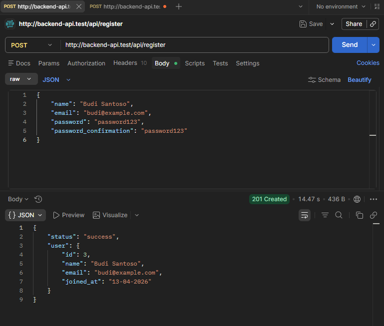
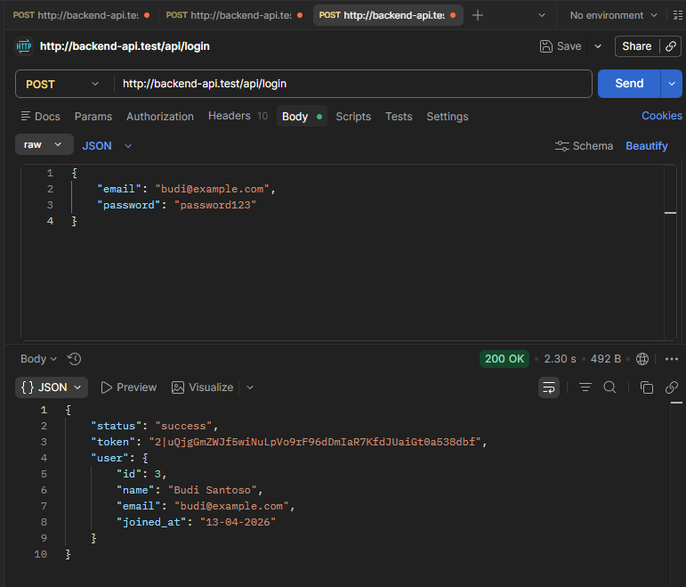
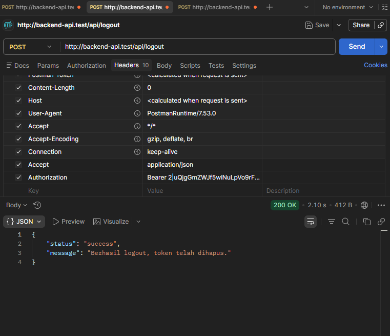

# Laravel 12 Auth API

Sistem autentikasi RESTful API yang dibangun dengan **Laravel 12** dan **Laravel Sanctum**.

## Tech Stack

- **Framework:** Laravel 12
- **Authentication:** Laravel Sanctum (Token-based)
- **Database:** MySQL
- **Architecture:** Controller-Service Pattern

---

## Fitur

- **Service Layer Pattern** — logika bisnis dipisahkan dari Controller ke dalam `AuthService`
- **Form Request Validation** — validasi input dipusatkan di kelas khusus (`RegisterRequest` & `LoginRequest`)
- **API Resources** — transformasi data menggunakan `UserResource` untuk mencegah kebocoran data sensitif
- **Bearer Token Authentication** — endpoint diamankan menggunakan token yang dapat dicabut saat logout
- **Consistent JSON Response** — struktur response yang seragam di semua endpoint

---

## Instalasi

```bash
# 1. Clone repository
git clone https://github.com/username/backend-api.git
cd backend-api

# 2. Install dependencies
composer install

# 3. Salin file environment
cp .env.example .env

# 4. Generate app key
php artisan key:generate

# 5. Atur koneksi database di file .env
DB_DATABASE=nama_database
DB_USERNAME=root
DB_PASSWORD=

# 6. Jalankan migrasi
php artisan migrate

# 7. Jalankan server
php artisan serve
```

---

## Endpoints

Base URL: `http://localhost:8000/api`

| Method | Endpoint    | Auth Required | Deskripsi        |
|--------|-------------|---------------|------------------|
| POST   | /register   | ❌            | Daftar user baru |
| POST   | /login      | ❌            | Login user       |
| POST   | /logout     | ✅ Bearer     | Logout user      |

---

## Register

**POST** `/api/register`

### Request Body

```json
{
    "name": "Budi Santoso",
    "email": "budi@example.com",
    "password": "password123",
    "password_confirmation": "password123"
}
```

### Response `201 Created`

```json
{
    "status": "success",
    "user": {
        "id": 3,
        "name": "Budi Santoso",
        "email": "budi@example.com",
        "joined_at": "13-04-2026"
    }
}
```

### Screenshot


---

## Login

**POST** `/api/login`

### Request Body

```json
{
    "email": "budi@example.com",
    "password": "password123"
}
```

### Response `200 OK`

```json
{
    "status": "success",
    "token": "1|abcdefghijklmnopqrstuvwxyz123456",
    "user": {
        "id": 1,
        "name": "Budi Santoso",
        "email": "budi@example.com",
        "joined_at": "08-04-2026"
    }
}
```

### Screenshot


---

## Logout

**POST** `/api/logout`

> Endpoint ini membutuhkan Bearer Token dari hasil login.

### Headers

```
Authorization: Bearer 1|abcdefghijklmnopqrstuvwxyz123456
```

### Response `200 OK`

```json
{
    "status": "success",
    "message": "Berhasil logout, token telah dihapus."
}
```

### Screenshot


---

## Menjalankan Unit Test

```bash
php artisan test
```

Hasil yang diharapkan:

```
PASS  Tests\Feature\AuthTest
✓ user dapat register dengan data valid
✓ register gagal jika email sudah terdaftar
✓ register gagal jika password tidak cocok
✓ register gagal jika password kurang dari 8 karakter
✓ register gagal jika field kosong
✓ password tidak muncul di response register
✓ user dapat login dengan kredensial benar
✓ login gagal jika password salah
✓ login gagal jika email tidak terdaftar
✓ login gagal jika field kosong
✓ user dapat logout dengan token valid
✓ logout gagal tanpa token
✓ logout tidak bisa pakai token yang sudah dipakai

Tests: 13 passed
```

---

## Struktur Project

```
app/
├── Http/
│   ├── Controllers/
│   │   └── AuthController.php
│   ├── Requests/
│   │   ├── LoginRequest.php
│   │   └── RegisterRequest.php
│   └── Resources/
│       └── UserResource.php
├── Models/
│   └── User.php
└── Services/
    └── AuthService.php
routes/
└── api.php
tests/
└── Feature/
    └── AuthTest.php
```
